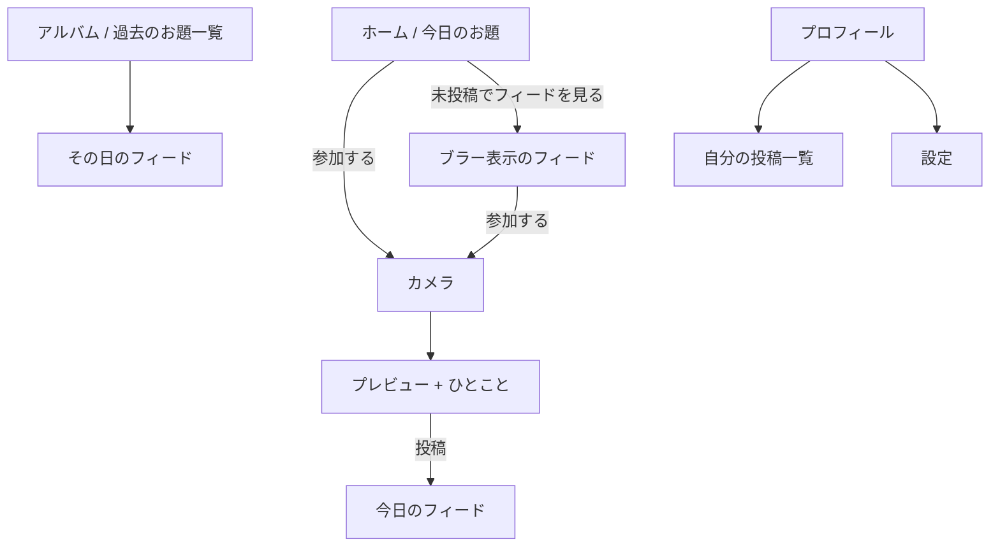

# ODAI 仕様書 v1.1

> **One prompt. One photo. Every day.**
> 毎日ひとつのお題に答えるだけの、日替わりお題SNS（Daily Prompt Social Network）。

| 項目 | 内容 |
| --- | --- |
| バージョン | v1.1 |
| 前版 | v1.0（コンセプト・機能一覧） |
| 状態 | **未検証**。§4 の検証をクリアするまで本開発に入らない |
| 対象プラットフォーム | iOS（先行） / Android |

---

## 0. この文書について

v1.0 は「作りたい機能の一覧」だった。v1.1 は **「意思決定の記録」** に作り替えている。

- 主要な設計判断は §5 に `D-01`〜`D-12` として番号を振り、**決定・理由・採用しなかった案**をセットで書く
- 決めていないことは §17 に「未決事項」として明示的に残す（黙って落とさない）
- 仕様の正しさより、**何を検証すれば正しいと分かるか**（§4）を先に置く

### v1.0 からの主な変更

| # | 変更 | 理由 |
| --- | --- | --- |
| 1 | **安全設計（通報・ブロック・自動判定）を追加**（§8） | 無いとApp Store審査 1.2 で確実にリジェクト。最優先の欠落だった |
| 2 | **ゲーティング（投稿しないと今日のフィードを見られない）を明文化**（D-01） | 参加率を決める最重要ロジックが未定義だった |
| 3 | **写真はその場撮影のみに限定**（D-02） | 「盛らなくていい」を思想ではなく仕様で担保するため |
| 4 | **「1日」の定義とタイムゾーンを確定**（D-03） | 「0:00更新」「残り18時間」「世界中で同じお題」が両立していなかった |
| 5 | **リアクションをお題ごとの可変セットに変更**（D-04） | 固定7種はお題と噛み合わない（「今日の敵」に☕）。ODAI固有の体験になる |
| 6 | **カテゴリー選択をMVPから削除**（D-05） | お題が全員共通なので分類の情報量がほぼ無い。投稿を1ステップ短縮 |
| 7 | **ストリークを緩和（フリーズ+週次指標）**（D-06） | 「SNS疲れしない」というコンセプトと真正面から矛盾していた |
| 8 | **アルバムを無料機能に格上げ、課金をスポンサードお題主軸に変更**（D-09 / D-10） | アルバムは唯一の乗り換えコスト。月300円の過去お題検索は課金理由として弱い |
| 9 | **非機能要件・ストレージ試算を追加**（§11） | このサービスの唯一のコスト構造。事業性の判断に必須 |
| 10 | **KPI・計測イベント・リスク登録簿・お題運用規程を追加**（§7 / §12 / §15） | 「お題の質」を測る手段が無いと、お題SNSは改善できない |

---

## 1. プロダクト定義

### 一行説明

**毎日出される1つのお題に、写真1枚で答えるだけのSNS。**

### なぜ作るか（問題設定）

既存SNSは、開くたびに**投稿する側にコスト**がかかる。

| サービス | ユーザーが払っているコスト |
| --- | --- |
| Instagram | 盛る・世界観を揃える |
| X | 面白いことを言う |
| BeReal | 通知の瞬間に反応する |
| 学習系SNS | 記録を続ける・数字を積む |

ODAI は **「今日は何を投稿するか」を考えるコスト** を運営が肩代わりする。
ユーザーがやることは「お題に写真で答える」だけ。ネタは毎日配られる。

### ジャンル

**Daily Prompt Social Network（日替わりお題SNS）**
「勉強SNS」「写真SNS」ではなく、お題という新しい単位でカテゴリを取りに行く。

### 非目標（このアプリがやらないこと）

- 人気を競う場をつくること
- 滞在時間を伸ばすこと（**むしろ1日3〜5分で終わらせる**）
- ユーザー同士の関係性を蓄積させること

> 滞在時間を伸ばさない、と明示的に決めている点は §13（収益）と直結する。
> 広告在庫が構造的に小さいので、インプレッション広告での収益化は最初から捨てる。

---

## 2. ターゲット

### メイン

**16〜28歳**（高校生 / 大学生 / 社会人1〜5年目）

### 初期ローンチ対象（M1 で狙う最初の300人）

全年齢に一斉公開しない。**1つの大学・1つのコミュニティ**に絞る。

理由：お題SNSは「同じお題の投稿が並んでいる」ことが体験の本体で、
投稿が10件しかない日が数日続くと、コンセプトそのものが成立しない（§15 R-02）。

### サブ

勉強中の人 / クリエイター / 楽器練習勢 / 語学学習勢 / 筋トレ勢

> ただし、これらは**ターゲットではなくお題の題材の供給源**として扱う。
> 「勉強SNS」に寄せると Studyplus との直接競合になり、勝ち目が薄い。

---

## 3. 競合と前例

| サービス | やったこと | 結果 | ODAIが学ぶこと |
| --- | --- | --- | --- |
| **BeReal** | 通知から2分・加工なし・**投稿しないと見られない** | 急成長 → 飽きで失速 → 買収 | ゲーティングは効く（D-01）。一方、**「毎日同じ体験」は飽きる**（→ D-04 の可変リアクション、§7 のお題運用で毎日の変化を作る） |
| **Poparazzi** | いいね廃止・自撮り禁止・フォロワー概念の再設計 | DL1位 → 失速 → クローズ | **承認欲求を消すと、開く理由も一緒に消える**。ODAIの答えは「お題」だが、それはまだ仮説（§4 H-1） |
| **Locket** | ウィジェットで友達の写真が届く | 定着 | 通知ではなく**ホーム画面の常在**が再訪を作る（→ §17 U-03 ウィジェット検討） |
| **Studyplus** | 記録の蓄積 | 定着（記録が資産） | **蓄積が乗り換えコストになる** → ODAIのアルバム（D-09） |
| **Pinterest** | グリッド閲覧・低圧な閲覧体験 | 定着 | フィードのUIモデルとして採用（§6.3） |

### この領域の構造的リスク

> 「承認欲求を排除したSNS」は、**同時に起動理由も排除してしまう**。
> Poparazzi はここで死んだ。ODAI の賭けは「お題そのものが起動理由になる」という一点であり、
> これを最初に、最も安く検証する（§4）。

---

## 4. 検証状況（これが最優先）

**現時点で v1.1 の内容は、ほぼすべて未検証の仮説である。**
実装より先に、以下の中核仮説を検証する。

### 中核仮説

| ID | 仮説 | 検証方法 | Go 基準 |
| --- | --- | --- | --- |
| **H-1** | お題があれば、人は毎日投稿する | LINEオープンチャット / Discord に50〜100人を集め、14日間毎日お題を出す | **14日目の参加率 ≥ 20%**（初日投稿者のうち14日目も投稿した割合） |
| **H-2** | 他人の回答を見るのが面白い | 同上。お題投稿後のスクロール/閲覧の有無、感想ヒアリング（n=10） | 「他の人の見るのが楽しい」と自発的に言う人 ≥ 5/10 |
| **H-3** | お題の良し悪しで参加率が大きく変わる | 14日間、日ごとの参加人数を記録 | 参加率の最大/最小に **1.5倍以上の差** が出る（＝お題は改善可能な変数だと確認できる） |

### M0（検証フェーズ）の設計

- 期間：**2週間**、コストほぼゼロ、アプリは作らない
- 毎朝8:00に手動でお題を投稿し、参加者は写真で返信する
- 記録するもの：日付 / お題 / 参加人数 / 初参加人数 / 復帰人数
- **H-1 が 20% を切った場合**、お題だけでは毎日開かせられないと判断し、
  D-01（ゲーティング）D-07（通知）を含めて設計をやり直す。実装には進まない。

> **この2週間をスキップして実装に入らないこと。** v1.1 で最も重要な決定はこれ。

### 実行キット

M0 はすぐ着手できる形にしてある → **[`docs/m0/`](m0/README.md)**

| ファイル | 用途 |
| --- | --- |
| [`m0/README.md`](m0/README.md) | 運用手順・判定表・参加者募集文 |
| [`m0/prompts.md`](m0/prompts.md) | 14日分の配信文（コピペでそのまま使える）＋ 各日の設計意図 |
| [`m0/attendance.csv`](m0/attendance.csv) | 参加者 × 14日の出席表（一次データ） |
| [`m0/daily-log.csv`](m0/daily-log.csv) | 日別のメモ（遅刻投稿・気づき） |
| [`m0/interview.md`](m0/interview.md) | H-2 のヒアリング台本（n=10） |
| [`m0/report.py`](m0/report.py) | 集計スクリプト（`python3 docs/m0/report.py`） |


---

## 5. 主要な設計決定

### D-01. ゲーティング：今日のフィードは、投稿するまで見られない

**決定**

- 今日のお題のフィードは、**自分が今日のお題に投稿するまでブラー表示**
- ブラー状態でも「今日 4,891人が参加中」の**人数と、ぼかしたグリッドの気配**は見せる
- **過去のアルバム（§6.4）は投稿しなくても自由に閲覧できる**

**理由**

- BeReal が証明した、参加率を最も強く押し上げる仕組み
- 「見るだけの人」が多数派になると、投稿者が減り、フィードが痩せて死ぬ
- ただし完全に閉じると、新規ユーザーが「中身が面白いか」を判断できずに離脱する
  → **今日＝閉じる / 過去＝開く** の非対称にすることで、獲得と参加率を両立させる

**採用しなかった案**

- 全面公開：閲覧専用ユーザーが増え、フィードが痩せる
- 過去も含めて全部閉じる：ストア掲載・SNSシェア・口コミからの新規が中身を見られず、獲得効率が落ちる

---

### D-02. 写真はその場撮影のみ。カメラロール不可、フィルタ・加工なし

**決定**

- 投稿はアプリ内カメラでの**その場撮影のみ**
- フィルタ、明るさ調整、トリミング、リテイク回数の表示 — **すべて無し**（撮り直し自体は無制限に可）
- インカメ/アウトカメの切替のみ許可

**理由**

v1.0 は「Instagramみたいに盛らなくていい」と宣言していたが、**それを担保する機能が1つも無かった**。
カメラロールを許した瞬間、ユーザーは過去の一番良い写真を選び始め、
1ヶ月で「盛りの品評会」になる。**思想ではなく仕様でコンセプトを守る。**

**採用しなかった案**

- カメラロール可：上記の通りコンセプトが崩壊する
- 「24時間以内に撮影された写真のみ選択可」：実装が複雑（Exif偽装の余地）で、得られる自由度に見合わない

**トレードオフ（認識した上で受け入れる）**

- 撮影が難しい状況（暗い・手が離せない）では投稿できない → お題の採用基準（§7.2）で「どこでも撮れるお題」に寄せることで緩和する

---

### D-03. 「1日」の定義：ローカル日付ベースのローリング配信

**決定**

- お題は **1日1つ、全世界で同じお題**（`odai_id` = 通し番号）
- 配信は**各ユーザーのローカル日付**基準。ローカル 00:00 に切り替わり、ローカル 23:59 が締切
- 結果として、同じお題が **約26時間かけて地球を一周する**
- 締切後も、西側のタイムゾーンからの投稿がフィードに増え続ける（仕様として許容）
- タイムゾーンはサーバ側に保持し、**変更の反映は24時間に1回まで**（早見え・二重投稿の防止）

**理由**

v1.0 は「毎日0:00に更新」「残り18時間」「世界中のみんなで同じお題」と書いていたが、
**UTC固定にすると誰かにとっては深夜3時に切り替わる**ため、この3つは同時に成立しない。

ローカル日付基準なら、
「朝に通知 → 日中に投稿 → 夜に締切」がどのタイムゾーンでも同じ形になり、
かつ「世界中が同じお題に答えている」も（同時ではないが）保たれる。

**採用しなかった案**

- **UTC 00:00 固定の24時間ウィンドウ**：全世界が完全に同時進行する美しさはあるが、
  米西海岸では夕方17:00に「今日のお題」が始まることになり、生活リズムと合わない
- 端末ローカル時刻をそのまま信用する：時刻変更で当日のお題を先に見る／二重投稿が可能になる

**表示ルール**

- ホームの残り時間は、**ユーザーのローカル 23:59 までのカウントダウン**
- 残り3時間を切ったら赤字に変わる（§9 の締切前通知と連動）

---

### D-04. リアクションは、お題ごとに変わる

**決定**

- 固定7種（🫡📚🔥☕😂😭👀）を廃止
- **お題ごとに、その日専用のリアクションを4〜6個配信する**

```
お題「今日の相棒」   → 🫡 🥹 💪 👏
お題「充電残量を見せて」→ 😱 😌 🔋 🫠
お題「今日の机」     → 👏 🫠 📚 ✨ 👀
```

- 1投稿につき1リアクションまで（変更可・取り消し可）
- **数のみ表示。誰が押したかは誰にも見えない**（自分の投稿でも見えない）

**理由**

- 固定セットは、お題と噛み合わない（「今日の敵」に☕は意味をなさない）
- **運用コストがほぼゼロなのに、毎日の体験が変わる**
  → BeReal が失速した「毎日同じ体験の飽き」への、最も安い対抗策
- お題とリアクションがセットで配信されるので、お題の作り手が体験を完全に設計できる
- 「誰が押したか」を隠すことで、リアクションの返礼義務（＝疲れ）が発生しない

**副次的な価値**

日ごとのリアクション分布そのものが「その日の世界の気分」のデータになる（将来の世界マップ機能に接続）。

---

### D-05. カテゴリー選択は MVP から削除

**決定**

投稿時の `Study / Coding / Reading / Art / Fitness / Random` 選択を廃止。
Explore は **「過去のお題を選ぶ」＋「フィード内の並び替え」** に置き換える（§6.3 / §6.4）。

**理由**

お題が全員共通である以上、カテゴリーの情報量がほとんど無い。
お題が「今日の机」の日は、Study にも Coding にも Art にも、ほぼ同じ写真が並ぶ。
分類軸として機能しないのに、**投稿フローに1ステップ増やしている**のが最大の問題。

**代替**

- フィードの並び替え：`新着 / リアクションが多い / 近くの人`
- Explore の入口：`過去のお題一覧`（＝アルバム、D-09）

---

### D-06. ストリークは緩和する

**決定**

| 表示 | 内容 |
| --- | --- |
| 主指標 | **総参加 64回** |
| 副指標 | **今週 4/7日** |
| 連続日数 | 表示する。ただし **Streak Freeze を月2回自動付与**（欠席時に自動消費） |

- **ストリークが切れそうだという通知は送らない**（§9）
- フリーズを消費したときのみ、事後に静かに知らせる

**理由**

v1.0 は「BeRealみたいに時間に縛られなくていい」「SNS疲れしない」と書きながら、
**1日休むと0に戻る、最も強力な疲労装置**を入れていた。ここは思想的な矛盾。

さらに実務的にも、連続記録が切れた日は**アンインストールの最大の引き金**になる。
「積み上がった総回数」を主役にすれば、1日休んでも失うものが無い。

---

### D-07. 通知は1日最大2回

**決定**

| タイミング | 内容 | 既定 |
| --- | --- | --- |
| ローカル朝（既定 8:00 / 変更可） | 今日のお題の告知 | ON |
| ローカル 21:00 | 自分の投稿へのリアクションを**1日1回まとめて** | ON |
| 締切3時間前 | 未投稿の人にだけリマインド | **OFF（ユーザーが任意でON）** |

- リアクションが付くたびの個別通知は**送らない**

**理由**

フォロー・コメント・DM を全部無くした結果、
**「自分の投稿に誰かが反応した」が唯一のソーシャル報酬**になる。これを切ると再訪理由が消える。
一方で個別通知にすると通知が1日20回来て、「SNS疲れしない」が嘘になる。
**まとめて1回**が唯一の解。

---

### D-08. 公開範囲は「国 → 世界」の段階公開

**決定**

- フィードの既定は **自国**。タブで `World` に切り替え可能
- 位置情報は取得しない。国はアカウント設定の申告値を使う
- サービス初期（登録者が少ない期間）は自国タブのみ表示し、母数が育ってから World を開放

**理由**

- 安全面：写真から生活圏が推測できるサービスで、初期からグローバル全公開はリスクが高い
- コールドスタート：ユーザー200人の時点で「世界中の投稿」を見せると、フィードが数枚で終わって体験が壊れる

---

### D-09. アルバムは無料。プレミアムの人質にしない

**決定**

- 過去のお題と、その日の全投稿の閲覧は**全ユーザー無料・無制限**
- 自分の過去の投稿を並べた「マイアルバム」も無料
- 1年後に **「去年の今日のお題」** をホームに表示する

**理由**

v1.0 はアルバム検索・保存をプレミアムに置いていたが、これは逆。
**1年分の「毎日の記録」こそが、このアプリ唯一の乗り換えコスト**であり、
競合が機能を模倣しても持っていけない資産。ここを課金の壁にするのは、
最大の武器を自分で封印している。

課金は §13 の通り、別の場所から取る。

---

### D-10. 収益はスポンサードお題を主軸に

**決定**（詳細は §13）

- 主軸：**スポンサードお題**（お題自体に企業がつく）
- 副：アルバムの書き出し（年間まとめ・フォトブック）の単発課金
- **バナー広告・インフィード広告はやらない**

**理由**

お題はもともと運営が出すもの。そこに企業が入っても体験の異物にならない。
一方、月300〜500円で「過去のお題検索」は、支払う理由として弱い（D-09 で無料化済み）。

---

### D-11. アカウントは電話番号なしで作れる

**決定**

- サインアップ：Apple / Google のOAuth、またはメール
- 電話番号は要求しない
- 実名不要。ハンドルネームのみ
- **生年月日を入力させ、16歳未満は登録できない**（§8.3）

**理由**

ターゲットの16〜28歳にとって電話番号は登録の最大の摩擦。
一方で年齢確認は法令上（GDPR-K / COPPA）省略できない。

---

### D-12. 投稿は1日1回、24時間以内なら削除できる

**決定**

- 1つのお題につき投稿は**1人1枚**
- 投稿の**差し替えは不可**、**削除は可能**（削除すると、その日は未参加に戻り、フィードのゲートも閉じる）
- 削除しても、ストリークは当日中の再投稿で復活する

**理由**

差し替え可にすると「より良い1枚」を探すゲームが始まり、D-02 の意図が崩れる。
一方、意図せず個人情報が写り込んだ場合に消せないのは重大な問題なので、削除は必ず用意する。

---

## 6. 画面仕様

### 6.0 ナビゲーション

タブは3つだけ。

```
[ ホーム ]   [ アルバム ]   [ プロフィール ]
```



### 6.1 ホーム

**未投稿の状態**

```
──────────────────────

        Today's ODAI

    「今見えている景色」

      残り 18:24:11

     [  参加する  ]

  今日 4,891人が参加中
──────────────────────
```

- 下にスクロールすると、**ブラーのかかった今日のフィード**（D-01）
- 1年経過後は、最下部に **「去年の今日：『今日の机』」** を1枚表示（D-09）

**投稿済みの状態**

- 上部が自分の投稿1枚に置き換わり、その下から今日のフィードが通常表示
- 並び替えタブ：`新着 / 反応が多い / 自国 / World`

**空状態（初日・投稿が少ない時）**

投稿が20件未満の場合、フィードの代わりに
「今日のお題はまだ始まったばかり。あなたが3人目です」と表示し、
**件数の少なさを失敗ではなく参加の価値として見せる**。

### 6.2 投稿画面

```
[ カメラ（全画面プレビュー） ]

     ○ シャッター     ⟳ 切替

     ↓ 撮影後

[ 撮った写真 ]

ひとこと（任意・30文字）
┌─────────────────┐
│ 数学と戦います              │
└─────────────────┘

        [  投稿する  ]
```

- カメラロールへの導線は**画面上に存在しない**（D-02）
- ひとことは30文字上限、絵文字のみも可
- カテゴリー選択は**無し**（D-05）
- 投稿ボタンを押してから**5秒間の取り消し**（Undo）を表示

### 6.3 フィード

- **Pinterest型の2カラムグリッド**（TikTok型の全画面スワイプは採用しない）
- 1タイル ＝ 写真 + ひとこと + リアクション数
- タップで拡大表示、そこで**その日専用のリアクション**（D-04）を押せる
- 誰の投稿かは、アイコンと名前のみ（**タップしてもプロフィールには飛べない**）

> **設計意図**：投稿からプロフィールに飛べないことで、
> 「この人の他の投稿を追う」という導線が生まれず、フォロー的な関係が発生しない。
> v1.0 の「フォローなし」を、UI レベルで担保する。

### 6.4 アルバム（旧 Explore）

```
──────────────────────
2026/08/21
「今日の机」        4,891人
──────────────────────
2026/08/20
「今飲んでいるもの」  5,102人
──────────────────────
```

- 過去のお題を日付順に一覧。タップでその日のフィード（全員分）へ
- 上部にマイアルバムへの切替（自分の投稿だけを日付順に）
- **全機能無料**（D-09）

### 6.5 プロフィール

```
     [ アイコン ]
       nonchan
      一言コメント

    総参加  64回
    今週    4/7日
    🔥 13日連続（❄︎ 残り2）
```

- 他人のプロフィールは、**そもそも到達できない**（§6.3 の通り導線が無い）
- つまりプロフィールは**自分専用の記録画面**であり、他人に見せる場ではない

### 6.6 設定

`通知（朝の時刻・締切前リマインドのON/OFF）` / `国` / `ブロックしたユーザー` /
`アカウント削除` / `利用規約` / `プライバシーポリシー` / `お問い合わせ`

### 6.7 オンボーディング

初回起動から**3画面で今日のお題に到達**させる。

1. コンセプト1枚（Scroll less. Participate more.）
2. アカウント作成（Apple / Google / メール）+ 生年月日
3. **いきなり今日のお題** → 参加する

チュートリアルは作らない。**最初の投稿を初回セッション内で完了させること**が唯一の目標（§12 の K-1）。

---

## 7. お題の運用

**お題＝このプロダクトのコンテンツそのもの。** ここが枯れた日にサービスが死ぬ。
したがって、お題は「思いついたら書く」ものではなく、規程に沿って運用する。

### 7.1 運用ルール

| 項目 | ルール |
| --- | --- |
| ストック | 常時 **90日分**を先行して確定させておく |
| 確定タイミング | 配信の**7日前**にロック（それ以降は差し替えない） |
| セット | お題文 + リアクション4〜6個 + 英語版 を1セットで管理 |
| 記録 | 配信後、参加率（§12 K-2）を必ず記録する |
| 再利用 | 参加率上位のお題は **1年後に再配信可**（アルバムの「去年の今日」と噛み合う） |

### 7.2 採用基準：撮影可能性テスト

以下を**すべて**満たすお題のみ採用する。

1. **30秒テスト**：今いる場所から動かずに、30秒以内に撮れるか
2. **場所非依存**：家・学校・職場・電車の中、どこにいても成立するか
3. **正解が無い**：「上手い写真」が存在しないか（＝競争にならないか）
4. **説明不要**：お題文を読んで、5秒で何を撮るか決まるか
5. **安全**：撮ると個人情報・他人の顔が写り込みやすくないか（§8）

### 7.3 v1.0 のお題の評価

| お題 | 判定 | コメント |
| --- | --- | --- |
| 今日の机 / 今飲んでいるもの / 右手にあるもの / 充電残量を見せて | ✅ 採用 | 30秒テストを通る。特に「充電残量」は誰でも撮れて、結果が全員違う優秀なお題 |
| 今日のカバンの中 | ⚠️ 条件付き | カバンを持っていない日がある。休日に配信しない |
| 今見えている景色 | ⚠️ 条件付き | 場所が特定されやすい。**投稿前に注意文を出す**（§8.2） |
| **今日の敵** | ❌ 不採用 → 改稿 | 抽象的で「何を撮るか」が決まらない（基準4で落ちる）。→ **「今日これと戦う」** に改稿すれば、教科書・提出物・体重計などが撮れて成立する |
| **今日の相棒 / 今日のヒーロー / 今一番大切なもの** | ❌ 不採用 → 改稿 | 同上。抽象語は投稿率を落とす。→ **「今日いちばん助けられたモノ」** など、モノに限定すると通る |
| 今日一番触ったもの | ✅ 採用 | ほぼ全員がスマホを出すが、それが**共通の笑い**になるので良い |

> **原則**：詩的なお題より、**具体物を指すお題**の方が参加率が高い。
> 面白いお題と、参加しやすいお題は別物である。

### 7.4 ローカライズ

- お題は日本語と英語を**同時に作る**（後から翻訳しない）
- 直訳が成立しないお題は、**言語ごとに別のお題文を用意してよい**（同じ `odai_id` を共有）
- 文化依存（受験・エナドリ・炬燵など）のお題は、配信地域を限定できるようにする

### 7.5 期間限定テーマ

試験期間、クリスマス、新学期など。**年間カレンダーとして先に置く**。

| 時期 | テーマ例 |
| --- | --- |
| 4月 | 新学期：「今年から使う新しいもの」 |
| 7-8月 | 試験・夏：「今日の眠気対策」「今いちばん冷たいもの」 |
| 12月 | 「今見えてる赤いもの」 |
| 1月 | 「今年の1枚目」 |

### 7.6 AIお題生成（将来）

**MVPでは使わない。** 理由は、お題の質がプロダクトの質そのものであり、
初期は人間が全力で作った方が確実に良いものが出るため。

将来的には「AIが100案生成 → 人間が §7.2 の基準で選別」という**下書き生成の用途**に限る。
無審査でAI生成お題を配信することは、安全上も品質上もしない。

---

## 8. 安全・モデレーション・法令

> **このセクションが v1.0 の最大の欠落だった。ここが未実装だとリリースできない。**

### 8.1 App Store 審査ガイドライン 1.2（UGC）対応

写真投稿がある時点で、コメントやDMが無くても対象になる。以下は**リリース必須要件**。

| # | 要件 | ODAI での実装 |
| --- | --- | --- |
| 1 | 不適切コンテンツの自動フィルタ | 投稿時にサーバ側で NSFW / 暴力 / 未成年性的表現を自動判定。高スコアは即時ブロック、中スコアは公開しつつ人手レビュー行きに |
| 2 | 通報導線 | すべての投稿に長押し → 通報（理由選択：性的/暴力/個人情報/なりすまし/その他） |
| 3 | 迷惑ユーザーのブロック | ブロックすると、そのユーザーの投稿が**全フィード・全アルバムから消える**（相互不可視） |
| 4 | 運営への連絡手段 | 設定画面にお問い合わせ + サポートメール、ストア掲載情報にも記載 |
| 5 | **24時間以内の対応体制** | 通報キューを毎日確認する運用当番を決める。M1（300人規模）では創業メンバーが直接見る |

**追加の防御**

- 同一投稿への通報が**3件**に達した時点で、人手レビューまで**自動的に非表示**にする
- 違反時：1回目 警告 / 2回目 7日間投稿停止 / 3回目 アカウント停止

### 8.2 写真から個人情報が漏れることへの対策

「今見えている景色」「今日のカバンの中」は、**部屋・制服・書類・住所・窓外の風景**が写る。

- **Exif は必ずサーバ側で完全に除去**（位置情報・端末情報・撮影日時）
- 位置情報リスクの高いお題（屋外・景色系）は、**投稿前に1回だけ注意文を出す**
  「家や学校が分かるものが写っていませんか？」
- 投稿は24時間以内なら削除可（D-12）
- 顔が写った投稿を検知した場合、投稿者に確認を出す（M2以降）

### 8.3 未成年・年齢

- 登録時に生年月日を入力させ、**16歳未満は登録不可**（GDPR-K の基準に合わせる）
- 日本国内のみのフェーズでも 16歳未満不可で統一する（後から緩めるのは容易、締めるのは困難）
- ストアのレーティング申請は、UGCを含む前提で行う

### 8.4 データとプライバシー

- 退会時：投稿画像・アカウント情報を**30日以内に完全削除**
- 削除された投稿は、他人のアルバム閲覧からも即座に消える
- プライバシーポリシー / 利用規約はリリース時に必須（テンプレ流用でよいが、**画像の利用範囲**は必ず明記）
- 投稿画像の権利はユーザーに帰属。運営はサービス提供に必要な範囲でのみ利用する

### 8.5 やらないこと

- 顔認識による人物のひも付け
- 位置情報の取得（国は自己申告、D-08）
- 投稿画像の学習データとしての第三者提供

---

## 9. 通知仕様

| ID | タイミング | 文言（案） | 既定 |
| --- | --- | --- | --- |
| N-1 | ローカル朝（既定 8:00・変更可） | `今日のODAI 「今見えている景色」` | ON |
| N-2 | ローカル 21:00 | `今日のあなたの投稿に 24 のリアクション` | ON |
| N-3 | 締切3時間前（未投稿の人のみ） | `あと3時間 —「今見えている景色」` | **OFF** |
| N-4 | Freeze 消費時（翌朝、N-1に併記） | `❄︎ を1つ使いました（残り1）` | ON |

**送らない通知**

- リアクションが付くたびの個別通知
- 「ストリークが切れます」という警告通知（D-06）
- 「◯◯さんが投稿しました」的な他人の行動通知（そもそもフォローが無い）

**設計方針**：通知は**1日最大2回**。ユーザーが減らす方向にしか設定できないようにする。

---

## 10. データモデルとAPI

### 10.1 主要テーブル

```
users
  id, handle, display_name, avatar_url, bio(60), country,
  birth_date, timezone, timezone_updated_at,
  created_at, deleted_at

odai                       -- お題マスタ（事前に90日分入る）
  id, publish_date, text_ja, text_en,
  reactions(jsonb: ["🫡","🥹","💪","👏"]),
  theme, countries(配信地域 / null=全世界), locked_at

posts
  id, user_id, odai_id, image_key, thumb_key,
  caption(30), country,
  moderation_state(pending/ok/hidden/removed),
  created_at, deleted_at
  UNIQUE(user_id, odai_id)   -- 1お題1投稿（D-12）

reactions
  post_id, user_id, emoji, created_at
  UNIQUE(post_id, user_id)   -- 1投稿1リアクション（D-04）

reaction_counts             -- 集計済みキャッシュ
  post_id, emoji, count

streaks
  user_id, current_days, best_days, total_posts,
  freezes_left, last_posted_date

reports
  id, post_id, reporter_id, reason, created_at, resolved_at

blocks
  blocker_id, blocked_id, created_at
```

### 10.2 API（概略）

| メソッド | パス | 説明 |
| --- | --- | --- |
| `GET` | `/v1/odai/today` | ユーザーのTZに基づく今日のお題 + リアクションセット + 締切時刻 + 参加人数 |
| `POST` | `/v1/posts` | 投稿（画像は署名付きURLへ直接アップロード後、キーを送る） |
| `DELETE` | `/v1/posts/{id}` | 削除（24時間以内・自分のみ） |
| `GET` | `/v1/feed?odai_id=&sort=new\|top&scope=country\|world&cursor=` | フィード。**未投稿かつ当日の場合は 403 相当のブラー用レスポンス**（件数のみ） |
| `PUT` | `/v1/posts/{id}/reaction` | リアクション設定/変更 |
| `DELETE` | `/v1/posts/{id}/reaction` | リアクション取り消し |
| `GET` | `/v1/album?cursor=` | 過去のお題一覧（誰でも可） |
| `GET` | `/v1/me` | プロフィール・ストリーク |
| `POST` | `/v1/reports` | 通報 |
| `POST` | `/v1/blocks` | ブロック |
| `DELETE` | `/v1/me` | アカウント削除 |

### 10.3 技術スタック（提案）

| 層 | 選定案 | 理由 |
| --- | --- | --- |
| モバイル | Flutter（または React Native / Expo） | 画面数が少なくカメラが中心。iOS/Android同時に出せることを優先 |
| バックエンド | Supabase（Postgres + Auth + RLS） | MVPの規模なら十分。RLSでブロック/ゲーティングを宣言的に書ける |
| 画像 | Cloudflare R2 + Images | **エグレス無料**が効く（§11.2）。リサイズも委譲できる |
| プッシュ | FCM / APNs | — |
| 自動判定 | Cloud Vision SafeSearch もしくは Hive | §8.1 の要件1 |
| 分析 | PostHog または BigQuery + 自前イベント | §12 のイベントが取れれば何でもよい |

> スタックは**決定ではなく提案**。§17 U-05 として未決に残す。

---

## 11. 非機能要件

### 11.1 画像処理

| 項目 | 値 |
| --- | --- |
| 本体画像 | 長辺 1440px / AVIF（フォールバック WebP）/ 品質70 → **約150KB** |
| サムネイル | 長辺 480px / WebP → **約20KB** |
| 原本 | **保持しない**（アップロード後に変換して破棄） |
| 保持期間 | 無期限（アルバムがコア資産のため、D-09） |

### 11.2 ストレージ試算

**前提：DAU 10万人 / 1人1枚 / 削除なし**

| 項目 | 計算 | 結果 |
| --- | --- | --- |
| 1日の増加 | 100,000 × 170KB | **17 GB/日** |
| 1ヶ月の増加 | 17GB × 30 | **510 GB/月** |
| 1年後の総量 | — | **約 6.2 TB** |
| 1年後の月額保管料 | 6.2TB × $0.015/GB | **約 $93/月** |

**原本（約3MB）を保持した場合との比較**

| | 1年後の総量 | 月額 |
| --- | --- | --- |
| 変換後のみ | 6.2 TB | 約 $93 |
| 原本も保持 | **108 TB** | **約 $1,620** |

> **20倍の差**。「原本を保持しない」は仕様上の重要な決定であり、後から変更できない。

**転送量**

- 1人1日あたり サムネイル100枚閲覧 ≒ 2MB → DAU10万で **200GB/日 = 6TB/月**
- 一般的なCDN（$0.08/GB）なら **月約$480**、R2 のエグレス無料なら **実質0**
  → **画像配信基盤の選定が、このサービスの原価をほぼ決める**

### 11.3 性能・可用性

- ホーム表示（お題取得）：**p95 < 500ms**
- 投稿完了（撮影 → 完了表示）：**p95 < 3秒**
- ピーク：ローカル朝8:00の通知直後に**日次DAUの30%が10分間に集中**する想定で設計する
- お題取得APIは全ユーザー共通の内容なので、**TZ+日付をキーに強くキャッシュ**する

### 11.4 アクセシビリティ

- リアクションは**絵文字＋数字**で表現し、色だけに意味を持たせない
- 画像には投稿者のひとことを alt として渡す（無い場合はお題文）
- 文字サイズはOS設定に追従。最小タップ領域 44pt

---

## 12. 計測とKPI

### 12.1 KPI

| ID | 指標 | 定義 | 目標 |
| --- | --- | --- | --- |
| **K-1** | 初回投稿完了率 | 初回起動セッション内に投稿を完了した割合 | **≥ 60%** |
| **K-2** | **参加率** | その日のアクティブユーザーのうち投稿した割合 | **≥ 45%** |
| **K-3** | D7 継続率 | 登録7日後も投稿した割合 | ≥ 35% |
| **K-4** | D30 継続率 | 登録30日後も投稿した割合 | ≥ 20% |
| **K-5** | **お題別参加率** | お題ごとの K-2。**お題の良し悪しを測る唯一の物差し** | 下位10%は再配信しない |
| **K-6** | アルバム再訪率 | 週1回以上アルバムを開いた割合 | ≥ 25%（乗り換えコストの指標） |
| **K-7** | 通報率 | 投稿あたりの通報件数 | < 0.5%（超えたらお題を疑う） |

> **K-2 と K-5 がこのプロダクトの心臓**。日次で見る。

### 12.2 計測イベント

```
app_open(source: notification|icon|widget)
onboarding_step(step, completed)
odai_view(odai_id)
camera_open(odai_id)
post_submit(odai_id, has_caption, retake_count)
post_cancel(odai_id, stage: camera|preview)
post_delete(odai_id, minutes_since_post)
feed_view(odai_id, gated: bool, sort, scope)
feed_scroll_depth(odai_id, tiles_seen)
reaction_add(post_id, emoji)
album_open(source)
album_odai_open(odai_id)
report_submit(reason) / block_add()
notif_open(type: N-1|N-2|N-3)
notif_disable(type)
```

- `post_cancel` と `retake_count` は **お題の難しさの代理指標**。
  撮影に入ったのに投稿されないお題は、§7.2 の基準1〜4 のどれかで失敗している。

---

## 13. 収益

### 13.1 主軸：スポンサードお題

```
──────────────────────
        Today's ODAI

    「今日いちばん書いたもの」

        presented by ○○
──────────────────────
```

- お題は**もともと運営が出すもの**なので、広告が体験の異物にならない
- ブランドは「その日、全ユーザーが自社の文脈で写真を撮る」という体験を買う
- **お題の内容は §7.2 の採用基準を必ず通す**（参加率が落ちる広告お題は、枠として無価値になる）
- 販売は月あたり**最大4日まで**（＝月の20%以下）とし、体験の希薄化を防ぐ

**試算モデル（数値は仮置き、要検証）**

| 変数 | 仮定 |
| --- | --- |
| DAU | 100,000 |
| 1日枠のリーチ | 100,000（全ユーザーが必ず見る面） |
| 月間販売枠 | 4日 |
| 枠単価 | ¥300,000（要市場検証） |
| 月間売上 | **¥1,200,000** |
| 月間原価（§11.2） | 約 ¥15,000 + 人件費 |

> **枠単価は完全に未検証。**M2 の時点で実際に1社に営業して確かめる（§17 U-04）。

### 13.2 副：アルバムの書き出し

- 「1年分の365枚」をフォトブック / まとめ動画として書き出す **単発課金 ¥1,500〜¥3,000**
- 年に1回、その人のアカウント記念日に提案する
- 月額サブスクリプションは**当面やらない**（D-09 の通り、機能を人質に取る形になるため）

### 13.3 やらないこと

- バナー広告・インフィード広告（滞在時間を伸ばさない設計なので在庫が小さく、体験だけ壊れる）
- 有料でリアクションを目立たせる、上位表示するなどの課金（競争を持ち込むため）

---

## 14. リリース計画

| マイルストーン | 期間 | 内容 | 完了条件 |
| --- | --- | --- | --- |
| **M0 検証** | 2週間 | アプリを作らず、LINEオープンチャット/Discord で50〜100人に毎日お題（§4） | **H-1 ≥ 20%** を確認 |
| **M1 クローズドβ** | 6〜8週 | iOSのみ。1大学/1コミュニティ 300人。ゲーティング・カメラ・フィード・アルバム・通報 | K-1 ≥ 60% / K-2 ≥ 40% |
| **M2 国内公開** | +8週 | Android対応、自国フィード、モデレーション体制、スポンサードお題の営業開始 | K-3 ≥ 35% / 通報対応24h体制が回る |
| **M3 英語圏** | +12週 | World タブ開放、お題の英語ネイティブ運用、地域別テーマ | 英語圏のK-2が国内と同水準 |

**M1 のスコープ（作るもの / 作らないもの）**

| 作る | 作らない |
| --- | --- |
| ホーム・カメラ・フィード・アルバム・プロフィール | Explore カテゴリー（D-05） |
| ゲーティング（D-01） | 世界マップ |
| お題ごとのリアクション（D-04） | AIお題生成 |
| 通報・ブロック・自動判定（§8） | プレミアム / 課金 |
| ストリーク（フリーズ込み） | ウィジェット |

---

## 15. リスク登録簿

| ID | リスク | 影響 | 確率 | 対策 |
| --- | --- | --- | --- | --- |
| **R-01** | **お題では毎日開く理由にならない**（Poparazzi 型の失速） | 致命 | 中 | M0 で最も安く検証する（§4）。Go 基準を下回ったら実装に進まない |
| **R-02** | 初期の投稿数が少なく、フィードが痩せて体験が成立しない | 大 | 高 | 1コミュニティに絞ってローンチ（§2）。20件未満は件数を出さず空状態コピーで見せる（§6.1） |
| **R-03** | 毎日同じ体験に飽きる（BeReal 型） | 大 | 高 | 可変リアクション（D-04）、期間限定テーマ（§7.5）、去年の今日（D-09） |
| **R-04** | お題のストックが枯れる / 品質が落ちる | 大 | 中 | 90日先行ストック + 採用基準の明文化 + K-5 による事後評価（§7） |
| **R-05** | 不適切投稿・個人情報流出による炎上 | 致命 | 中 | §8 全体。特に Exif 除去と 24h 対応体制 |
| **R-06** | 審査リジェクト（UGC要件不足） | 大 | **高**（対策前は確実） | §8.1 のチェックリストを M1 完了条件に含める |
| **R-07** | ストレージ費用の増大 | 中 | 中 | 原本を保持しない（§11.1）。エグレス無料のR2を選ぶ |
| **R-08** | 枠単価が想定を大きく下回り、事業が成立しない | 大 | 中 | M2 で実際に営業して検証（U-04）。ダメならアルバム書き出しの単発課金へ寄せる |
| **R-09** | 承認欲求の受け皿が無く、投稿の動機が続かない | 大 | 中 | N-2（リアクションまとめ通知）が唯一の報酬。ここを消さない（D-07） |

---

## 16. やらないことリスト

| 機能 | 理由 |
| --- | --- |
| フォロー / フォロワー | フォロワー競争を生む |
| DM | 未成年を含むサービスで最大のリスク源。運用コストも高い |
| コメント | 誹謗中傷の主戦場。リアクションで代替 |
| いいね（数の可視化を伴う汎用リアクション） | 承認欲求競争を生む。お題ごとの絵文字で代替（D-04） |
| ランキング / トレンド | 映え競争を生む |
| シェア（外部SNSへの投稿導線） | 「外で評価される」動機が入り込み、盛りが始まる |
| プロフィールへの遷移 | 実質的なフォロー関係が生まれる（§6.3） |
| 滞在時間の最大化 | プロダクトの目的と逆行する |
| カテゴリー選択 | 情報量が無く、投稿フローを長くするだけ（D-05） |

---

## 17. 未決事項

| ID | 論点 | 決める時期 |
| --- | --- | --- |
| **U-01** | サービス名。`ODAI` は日本先行なら強い（短い・被らない・意味が立つ）が、英語圏では読み方が伝わらない。英語圏展開時に別名を使うか | M2 |
| **U-02** | 「投稿しない日」の扱い。閲覧だけの日が続くユーザーに何を見せるか | M1 |
| **U-03** | ホーム画面ウィジェット（Locket 型）。再訪への効果が大きい可能性 | M2 |
| **U-04** | スポンサードお題の枠単価。実際に営業して確かめる | M2 |
| **U-05** | 技術スタックの確定（§10.3 は提案） | M1 着手前 |
| **U-06** | 締切後の投稿を許すか（「遅刻投稿」枠を作るか）。参加率は上がるが「同じ日に同じお題」の緊張感は薄れる | M1 のβで実験 |
| **U-07** | 世界マップ機能の位置づけ。参加人数の可視化は面白いが、国別の数字は競争を生む可能性がある | M3 |

---

## 付録A. お題ストック

### A-1. M0（検証2週間）で使う14本 — リアクション付き

| Day | お題 | リアクション |
| --- | --- | --- |
| 1 | 今日の机 | 👏 🫠 📚 ✨ |
| 2 | 今飲んでいるもの | ☕ 🧊 🍵 🥤 |
| 3 | 充電残量を見せて | 😱 😌 🔋 🫠 |
| 4 | 今あなたの右側にあるもの | 👀 😂 🫡 ✨ |
| 5 | 今日いちばん触ったもの | 📱 😂 🫡 🥹 |
| 6 | 一番使っているペン | ✍️ ✨ 🫡 😂 |
| 7 | 今日これと戦う | 💪 😭 🔥 🫡 |
| 8 | 今日の足元 | 👟 ✨ 🫡 😂 |
| 9 | いま手が届く場所にある本 | 📖 👀 ✨ 🫠 |
| 10 | 今日の空 | 🌤 😍 🫠 👀 |
| 11 | いちばん古くから使っているもの | 🥹 🫡 ✨ 👏 |
| 12 | 今日食べたいちばん美味しかったもの | 😋 🤤 👏 🥹 |
| 13 | 机の上でいちばん邪魔なもの | 😂 🫠 👀 😭 |
| 14 | 今日おつかれさまの1枚 | 🫡 🥹 👏 😴 |

### A-2. ストック（採用基準通過済み・40本）

```
今日のカバンの中          いま座っている場所
今日のイヤホン            画面の明るさを見せて
今開いているノート        今日いちばん歩いた靴
冷蔵庫を開けて1枚        今日のポケットの中身
いま一番近くにあるコード類  today's 充電ケーブル
机の引き出しの中          今使っているマグ
今日の時計/時刻           いま部屋で一番明るいもの
今日のキーホルダー        いま画面に映っているもの
今日買ったもの            いちばん最近届いた荷物
今使っているリップ/ハンドクリーム  いま聴いている曲の画面
今日のフォント（書いた文字）  今いる場所の天井
今日のごはん1枚           カレンダーを見せて
いま一番減っているもの     今日の手のひら
バッグの一番外側のポケット  今日いちばん重かったもの
いま使っている椅子        今日の窓の外の色
いちばん最近撮った紙       今日のメモ
使い切りそうな消耗品       いまの散らかり具合
今日のマスク/眼鏡         いま鳴っている音の出どころ
今日いちばん開いたアプリ   いま温かいもの
机の上でいちばん古いもの   今日ここまで来た手段
```

> いずれも §7.2 の5基準（30秒 / 場所非依存 / 正解が無い / 説明不要 / 安全）を通している。
> 「今日の敵」「今日の相棒」「今一番大切なもの」など v1.0 の抽象系は、
> §7.3 の通り改稿した上でのみ採用する。

---

## 付録B. 用語集

| 用語 | 定義 |
| --- | --- |
| **ODAI（お題）** | 1日1つ配信される、写真で答えるための問い。`odai_id` で一意 |
| **参加** | その日のお題に写真を投稿すること。閲覧は参加に含まない |
| **参加率（K-2）** | その日のアクティブユーザーのうち参加した人の割合 |
| **ゲート** | 未参加の状態で今日のフィードがブラーになっている状態（D-01） |
| **リアクションセット** | お題ごとに配信される4〜6個の絵文字（D-04） |
| **Freeze（❄︎）** | 月2回自動付与される、ストリークの欠席補填（D-06） |
| **アルバム** | 過去のお題と、その日の全投稿を閲覧できる領域 |

---

## 付録C. コピーとネーミング

### キャッチコピー

| 案 | コピー | 評価 |
| --- | --- | --- |
| **推し** | **Scroll less. Participate more.**（眺めるより、参加しよう。） | プロダクトの主張が最も明確。ゲーティング（D-01）と一直線に繋がる |
| 2 | 投稿する理由があるSNS。 | 日本語圏の説明として最良。ストア説明文の1行目に使う |
| 3 | One prompt. One photo. Every day. | 機能説明として正確。サブコピー向き |
| 4 | 今日のお題に答えよう。 | 説明的すぎる |
| 5 | 世界中のみんなで同じお題。 | D-03 の「26時間かけて一周する」仕様と厳密には合わない。使うなら注意 |

### サービス名

- **`ODAI`**：日本先行なら強い。短い / 被らない / 意味が立つ / ローマ字表記が可愛い
- `Prompt`：**AI を強く連想させる**ため、2020年代のプロダクト名としては不利。候補から外す
- `Dailies` `Today?` `Seen` `Loop` `TapIn`：一般名詞に近く、商標・検索性で不利
- 英語圏展開時に `ODAI` を維持するか改名するかは U-01 として保留

---

**変更履歴**

| 版 | 日付 | 内容 |
| --- | --- | --- |
| v1.0 | — | コンセプト・機能一覧 |
| v1.1 | 2026-08-22 | 安全設計・ゲーティング・タイムゾーン・可変リアクション・KPI・非機能・リスクを追加。カテゴリー削除、ストリーク緩和、課金方針を変更 |
